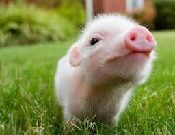

# [Test case 12] Image with same source file - Image Alt Text Duplicated

## 1. Against the rule
## 2. Follow the rule

--------------------------------------------------
Result: 
    "same image alt text": 0