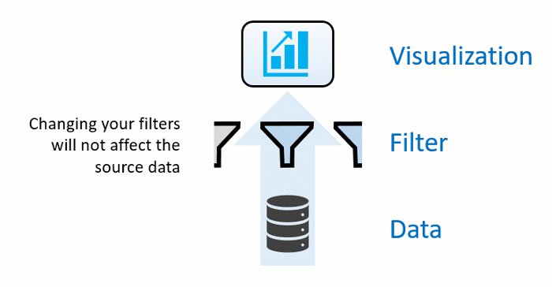
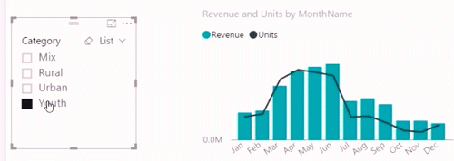

Data is the core of Power BI. As you explore reports, each visual draws its underlying data from sources that often contain far more data than you need. Power BI offers several ways to filter and highlight reports. Knowing how to filter data is the key to finding the right information.

> [!NOTE]
> Filtering only applies to reports, not to dashboards.

> [!Note] 
>  When you filter a visual like a bar chart, you are just changing the view of the data in that visual. You’re not modifying the source data in any way. 

## Slicers

A simple type of filtering that you can use directly on the report page is called a **slicer**. Slicers provide cues to ways you can filter the results in the visuals on a report page. There are several different types of slicers: numeric, categorical, and date. Slicers make it easy to filter all the visuals on the page at once.

If you want to select more than one field, hold the Ctrl key and click additional fields.  

## Explore the Filters pane

Another way to filter data is by opening and modifying filters in the Filters pane. The Filters pane contains filters that were added to the report by the report designer. As a consumer, you can interact with the filters and save your changes but can't add new filters. 

The four types of filters are:
-   **Report** – Applies to all pages in the report.
-   **Page** – Applies to all the visuals on the current report page.
-   **Visual** – Applies to a single visual on a report page. You only see visual level filters if you've selected a visual on the report canvas.
-   **Drillthrough** – Allows you to explore successively more detailed views within a single visual.

