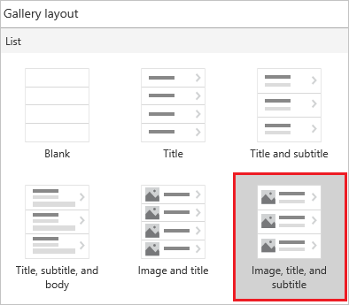
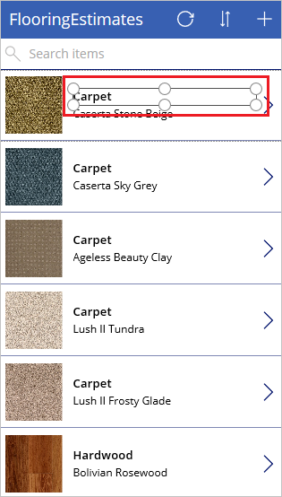
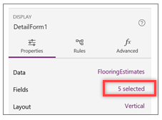

# I am test H1

In a previous unit, you generated the Flooring Estimates app and started to explore its default design. Apps that Microsoft PowerApps generates are useful out of the box, but you'll often want to customize a generated app to suit your needs.

In this unit, we'll walk you through some basic changes for each screen in the app. You can do a lot more to customize an app, but the best way to start learning is to take any generated app and make common customizations.

I am test link in local [link in local](https://azure.microsoft.com/en-us/free/)
I am test link not secure [secure](http://azure.microsoft.com/free/)
I am test link not secure but has locals [secure](http://azure.microsoft.com/en-us/free/)

## Browse screen
We'll start on the browse screen. The app already shows an image and some text for each product, but the layout could be better. Let's work on that.

1. In the **Screens** pane on the left, select **BrowseGallery1**.

    The selection box around the gallery confirms your choice.

    

1. In the right pane, open the **Data** pane by selecting the link next to **Layout**.

    

1. Select a different layout, such as the one that shows the image, the title, and the subtitle but not the body.

    

1. Select the category of the item at the top of the gallery.

    

1. Change **ThisItem.Category** to **ThisItem.Name** in the formula bar.

1. Repeat the previous two steps, but change the other **Label** control to show the price of each item.

    

It's that easy to change the layout of a gallery and the types of data that it shows. And you might find that it's fun too!

## Details screen

On the details screen, we want to change the order of the fields. The controls on this screen differ from the controls on the browse screen, so the process for changing them is also a little different.

1. On the **Screens** pane on the left, select **DetailForm1**.

1. In the right pane, select the text that shows the number of selected fields.

    

1. Drag the **Name** field to the top of the list of fields, and drag the **Image** field to the bottom.

    

## Edit/create screen

Finally, on the screen where your user edits and creates entries, we want to make it easier to enter information in a text box.

1. On the **Screens** pane on the left, select **EditForm1**.

1. In the right pane, select the text that shows the number of selected fields.

1. Select the drop-down arrow for the **Overview** list, and then select **Edit multi-line text**.

    A multi-line edit control will make it easier to add more than a few words in this field.

    

You've seen how a few basic steps can do a lot to improve the appearance and experience of using an app. In this unit, we focused on PowerApps Studio, which provides lots of options for customizing apps. In the next unit, we'll explore the controls in the app in greater detail.