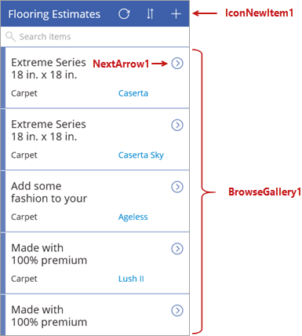
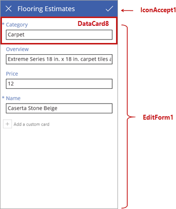

We're now going to look more closely at the screens and other controls that define the behavior of apps that Microsoft PowerApps generates. We won't go through all the details, but knowing more about how these apps work will help you build your own apps.

## Understand controls in PowerApps
A control is just a UI element that produces an action or shows information. Many of the controls in PowerApps are just like controls that you've used in other apps: labels, text-input boxes, drop-down lists, navigation elements, and so on.

In addition to these typical controls, PowerApps has more specialized controls, which you can find on the **Insert** tab.
[securit link and local inside](http://docs.microsoft.com/en-us/)

 [!include] 
Here are just a few of the controls that can add interest and impact to your apps:

- **Galleries**: These controls are layout containers that hold a set of controls that show data from a data source.
- **Forms**: These controls show details about your data and let you create and edit items.
- **Media**: These controls let you add background images and include a camera button (so that users can take pictures from the app) and a barcode reader for quickly capturing identification information.
- **Charts**: These controls let you add charts so that users can do instant analysis while they're on the road.

To see what's available, select the **Insert** tab, and then select each option in turn.

## Explore the browse screen

Each screen in the app has multiple controls, but one control takes up most of the screen space. The first screen in the app is the browse screen, which is named **BrowseScreen1** by default.

Here are some of the controls that you'll want to become familiar with for the browse screen:

- **BrowseGallery1**: This control takes up most of the screen and shows data from your data source.
- **NextArrow1**: When this control is selected, it opens the details screen.
- **IconNewItem1**: When this control is selected, it opens the edit/create screen.

## Explore the details screen
Next is the details screen, which is named **DetailScreen1** by default. Here are some of its controls:

- **DetailForm1**: This control contains other controls.
- **DataCard1**: This is a card control. In this case, it shows a flooring category from the Flooring Estimates table, as seen in the previous unit.
- **IconEdit1**: When this control is selected, it opens the edit/create screen so that the user can edit the current item.

## Explore the edit/create screen
The third screen in the app is **EditScreen1**. Here are some of its controls:

- **EditForm1**: This control contains other controls.
- **DataCard8**: This is another card control that shows a flooring category from the Flooring Estimates table, as seen in the previous unit.
- **IconAccept1**: When this control is selected, it saves the user's changes.

Hopefully, this unit gives you a good idea of what controls are on each screen of this app.